# Pole Position — a 3D remaster (unofficial fan project)

**The 1982 arcade racer, rebuilt in 3D for the browser, with a few hundred metres of trackside billboards that are really a love letter.**

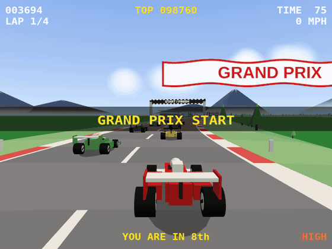

TypeScript · Vite · Three.js · Web Audio · no downloaded assets. Every model, texture, jingle and engine note is generated in code.

> **Unofficial fan project. Not affiliated with, endorsed by or connected to Bandai Namco Entertainment.** "Pole Position" is a trademark of its respective owner. No original assets, code, ROM data or sounds are used. The art is procedural, the sponsors are made up, and the music is new.

```bash
npm install
npm run dev        # http://localhost:3000, then press Enter
```

---

## Insert coin: a short story

*Summer, 1982. A seafront arcade in Essex.*

The cabinet stood at the back, past the penny falls and a claw machine nobody had ever beaten. It had a real steering wheel, a gear stick with exactly two settings, and a screen that drew the horizon in eight colours and a lot of confidence.

You fed it your last ten pence. A biplane dragged a banner across the sky: **QUALIFYING LAP**. Three red lights came on one by one, then went green, and you found out that LOW gear will get you off the line and nowhere else. Shift up. Two hundred miles an hour. Mount Fuji sitting on the horizon like a paperweight.

You learned a few things on that first lap. Puddles spin you. Grass is basically glue. Billboards are made of something much harder than cardboard, and when you hit one the car goes up in an orange ball of pixels and the clock keeps running. You learned that **58.5 seconds** is pole, **73** is the cut-off, and the gap between them is a whole summer's pocket money.

Forty-odd years later the cabinet has gone, the arcade is a coffee shop and the ten pences are in a jar somewhere. The lap is still here, though, rebuilt in three dimensions so the mountains have a far side and the billboards cast real shadows.

The billboards have changed too. They've stopped selling tyres and petrol, and if you look at them properly at 200 mph they tell a different story.

---

## The roadside: Lizzie & Chris

<p align="center">
  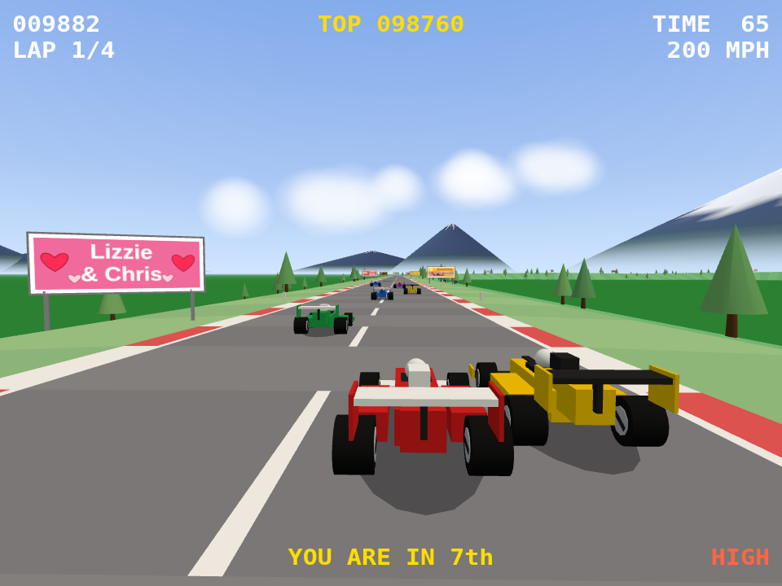
</p>

In the arcade the roadside was lined with sponsors. Here **29 of the billboards on every course are personal**. They are hand-drawn in code (canvas paths, not image files), one for every place, pet and in-joke in a shared life, and they are spaced 100 metres apart so you can take them in on a flying lap.

Go round once and you have driven past the whole story:

- **Peterborough**, *where it all began*.
- **Lizzie & Chris**, in pink with hearts, sixth board from the line, so nobody misses it.
- **Just Married, Hither Green Church**.
- Home turf: **Welcome to Chelmsford**, **Chelmsford, Essex**, **Chelmsford: Home of Radio** (*Marconi, 1898*), **Beaulieu Park** and its **Deer Crossing**.
- The family: **Monty the Moose** and **George the Monkey**.
- Places that stuck: **Toronto** and **Oh Canada!**, **Scotland the Brave** (*haste ye back*), **Belfast**, **Osnabrück**, **Glastonbury Tor**, sunshine at **Maspalomas**, and the **Secret Club** in Gran Canaria.
- London, in bulk: **London Calling!**, **Mind the Gap**, **Houses of Parliament**, **Curzon Soho**, **Shy London**, the **Double R Club**, **Penderel's Oak** and a sticky toffee pudding at **Ye Olde Cheshire Cheese**.
- And for the cool-down lap: **Buddhism** (*the Middle Way*), **Silent Retreat** and **Non-Self**.

<p align="center">
  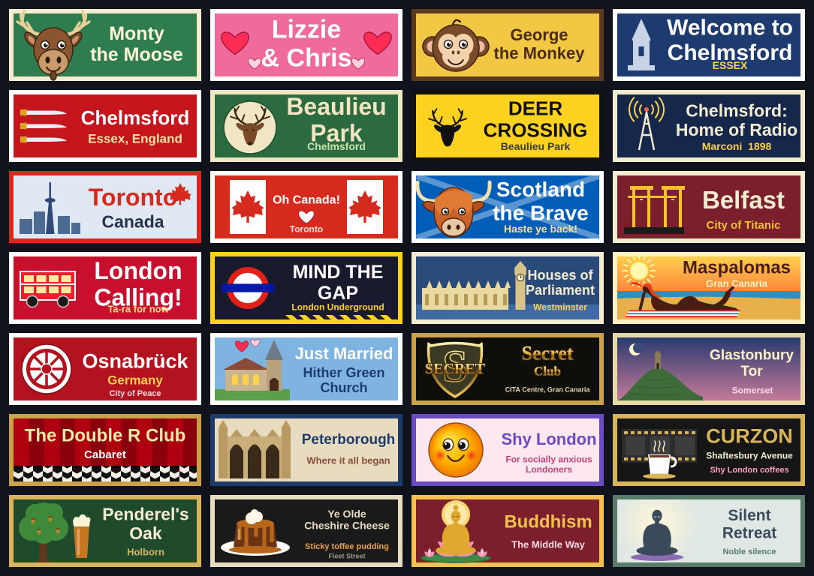
</p>

They aren't only decoration. Every sign is a real collision box, so **hitting Lizzie & Chris at 200 mph blows you up just like hitting anything else**. Admire them from the racing line.

> Want your own? Add a name to `CUSTOM_SIGNS` and a slot in `CUSTOM_SIGN_SLOTS` (`src/sim/scenery.ts`), then a drawer in `src/remaster/signArt.ts`. Each sign is a 512×192 canvas, and the helpers `frame`, `textLines` and `heart` will get you most of the way.

---

## What's in the box

| | |
|---|---|
| 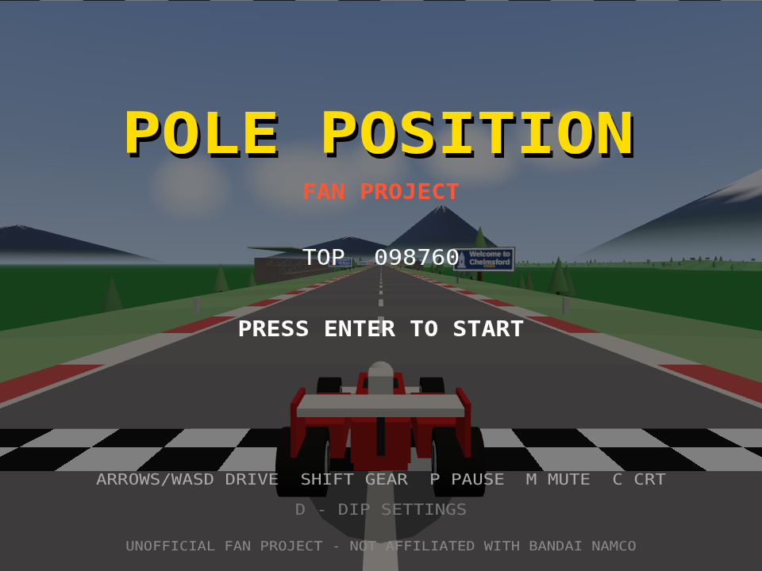 | 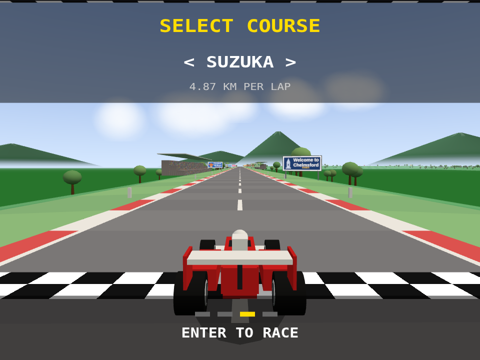 |
| **Attract mode.** A title card and a live autopilot demo with traffic, just like a cabinet waiting for its next ten pence. | **Four circuits**, chosen with ← / →. |
| 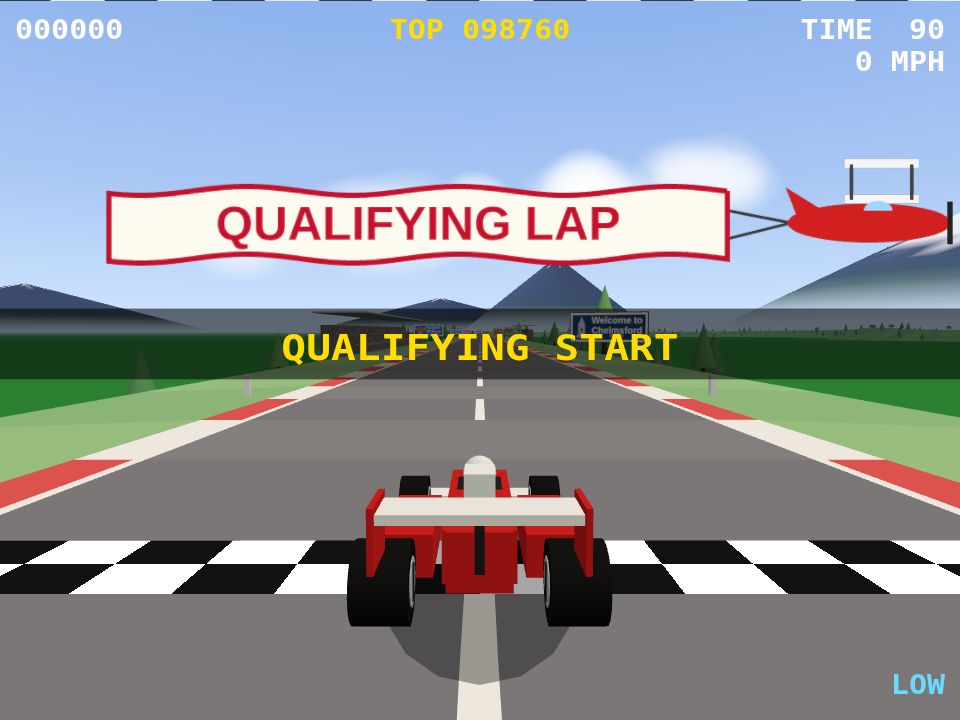 | 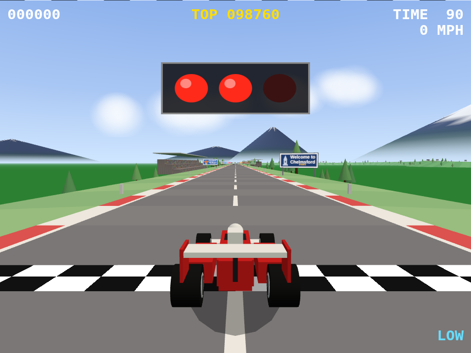 |
| **The flyby.** A biplane trails the QUALIFYING LAP / GRAND PRIX banner over the gantry. | **Three reds, then green.** The car is held until the lights go. |
| 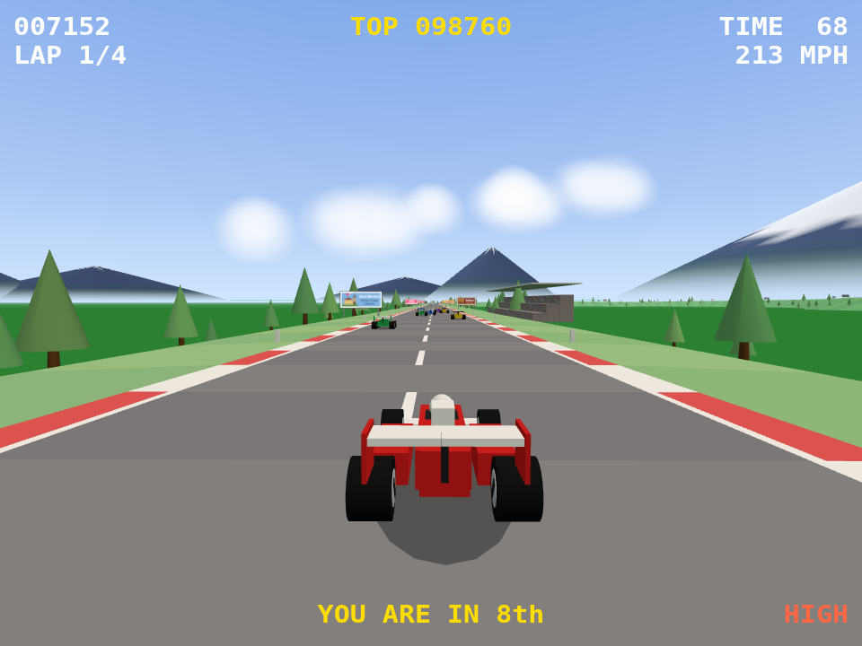 | 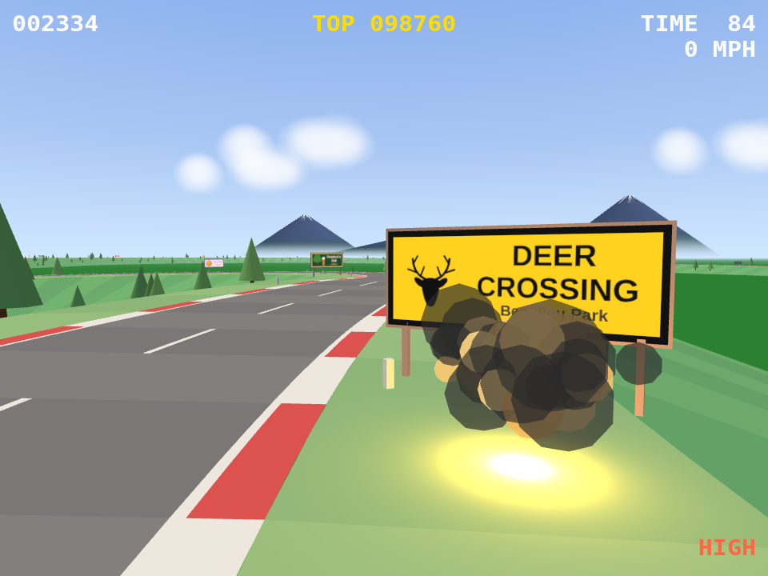 |
| **The Grand Prix.** Seven rivals in fixed lanes at fixed speeds, with no rubber-banding, the same as 1982. | **The explosion.** Billboards and cars are solid. The camera pulls back, the clock keeps going. |

### The courses

| | |
|---|---|
| 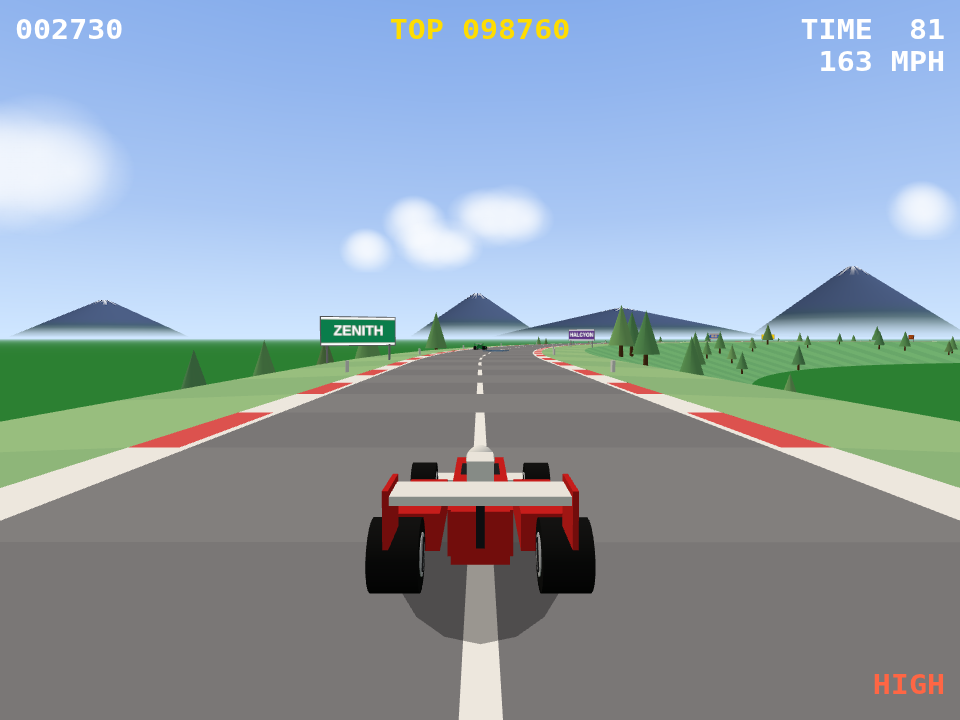 | 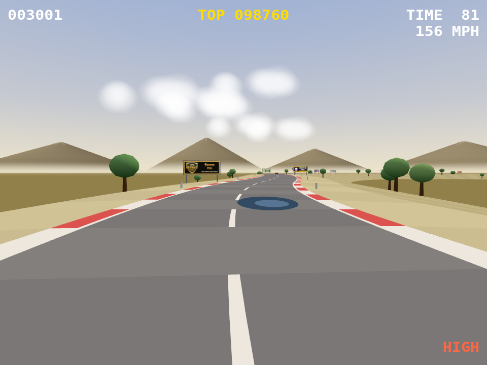 |
| **Fuji Speedway** (4.36 km): the arcade circuit, with the mountain on the horizon. | **Test Course** (2.97 km): short, dusty and quick. |
| 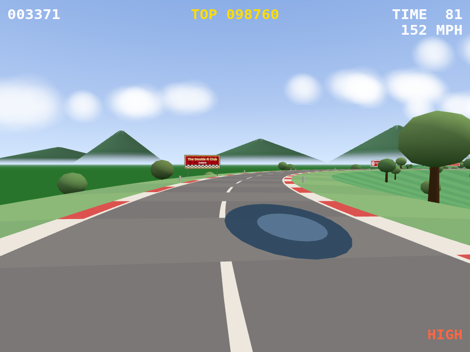 | 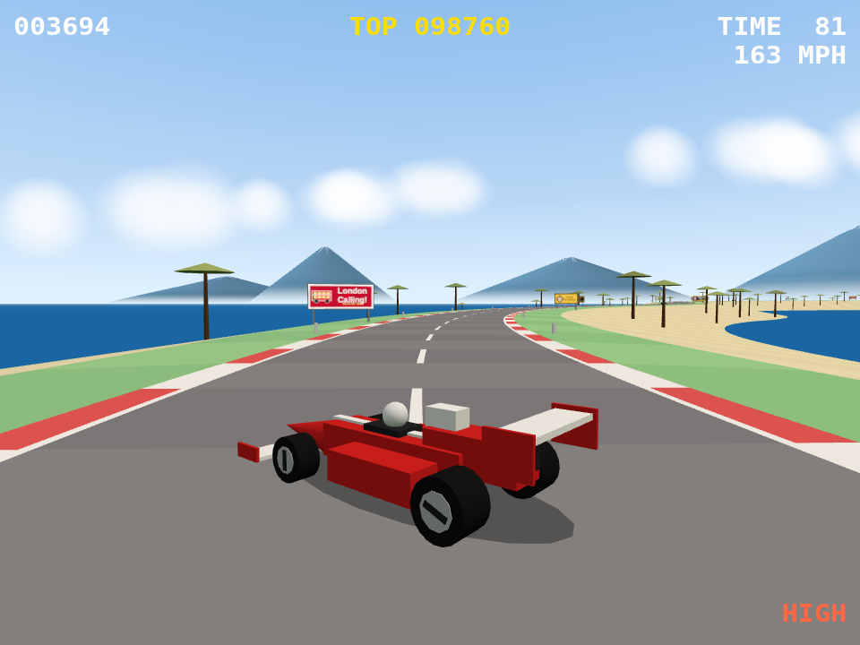 |
| **Suzuka** (4.87 km): the long one, through green hills. | **Seaside Speedway** (3.76 km): palms, sand and a lot of sea. |

All four layouts were solved numerically so they close exactly (heading, position and height) and never cross themselves, and a test checks every course to keep it that way. Qualifying thresholds and Grand Prix time scale with lap length, so 58.5 s at Fuji is equally hard everywhere.

---

## Controls

| Key | Action |
| --- | --- |
| ↑ / W | Accelerate |
| ↓ / S | Brake |
| ← → / A D | Steer |
| Shift | Toggle LOW / HIGH gear (start in LOW, shift up around 100 mph) |
| Enter / Space | Start, confirm |
| P or Esc | Pause (switching tabs mid-race pauses too) |
| M | Mute |
| C | CRT scanline look |
| D (title screen) | DIP switch settings |

## How it plays

1. **Insert coin** with Enter and pick a course.
2. **Qualify.** One timed lap. Your time sets your grid slot: under **58.5 s** is pole, and **73 s or slower** at the default rank means you didn't qualify and it's game over.
3. **Race the Grand Prix.** Four laps against seven cars and a countdown that starts at 75 s. Each completed lap adds time (+51 s, +57 s, +61 s).
4. **Enter your initials** if the score makes the top ten. High scores are saved in your browser.

| Scoring | Points |
| --- | --- |
| Distance | 10 per metre |
| Overtake | 50 per car |
| Qualifying | 4,000 for pole, down to 200 for 8th |
| Time bonus | 200 per second left at the flag |

Puddles spin you and grass slows you to 30 mph. Cars and billboards blow you up.

### DIP switches

Press **D** on the title screen for the operator settings, which are remembered between sessions:

| Switch | Options |
| --- | --- |
| Qualifying time | 90 / 100 / 110 / 120 s |
| Practice rank | A (80 s cut-off) … C (73 s) … H (60 s) |
| Extended rank | AI speed from 0.55× (A) to 1.3× (H) |
| Lap count | 3 / 4 / 5 / 6 |
| Speed | Average 195 / Default 225 / High 244 mph |
| Units | MPH / KPH |

<p align="center">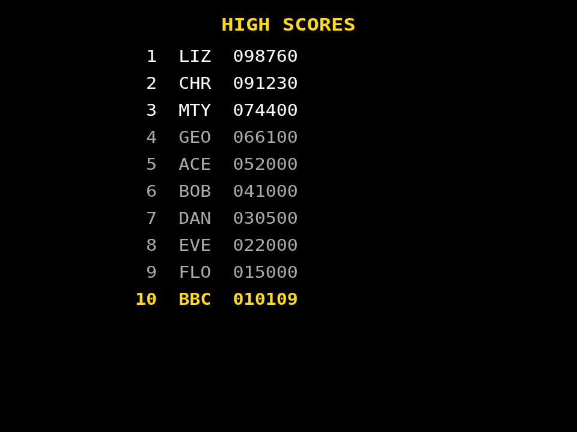</p>

---

## Under the hood

The project has two halves, and Three.js is never imported into the simulation:

- **`src/sim/`** is a pure simulation in metres and seconds: the track centreline built from segments of length, curvature and slope, a player car with two gears and grip-limited corner push, the AI field, hazards and collision boxes in track space, and a 60 Hz fixed-step loop with interpolated rendering. It is unit-tested without WebGL.
- **`src/remaster/`** builds the world: road and terrain meshes, procedural sky and mountains, trees, grandstands, the gantry, low-poly cars, the explosion, and the billboards and their art. `Game.ts` wires everything to the arcade state machine in `src/state/`.
- **HUD and screens** are drawn on a 256×224 canvas overlay, the original's resolution, scaled to the display.
- **Audio** is all Web Audio synthesis: an oscillator engine note tied to speed, tyre squeal, grass rumble, crash noise, voice-style announcements and wavetable-flavoured chiptunes for the jingles.

```bash
npm run dev          # dev server on :3000
npm run build        # typecheck + production build
npm run check        # typecheck + lint + prettier + ~700 tests (run before committing)
```

Add `?debug` to the URL to get `window.__game` (`debugGoto`, `debugCourse`, `debugTeleport`, `debugInfo`), and `?autopilot` to let the built-in driver race. That is how headless Chrome play-tests, and the screenshots and GIF in this README, were made.

The game was built with a "Ralph Wiggum" agent loop (`loop.sh`, `PROMPT_build.md`, `IMPLEMENTATION_PLAN.md`), working from the requirements in `specs/` and the arcade notes in `research.md`.

### Recent fixes

Three rounds of play-testing found and fixed bugs including: key taps lost between frames, Shift auto-repeat flipping gears, a dead Practice Rank switch, slow qualifying laps still starting the race, the player's car turning invisible on the Grand Prix grid, demo traffic not being drawn, audio leaking through the pause screen, and name entry waiting forever on an unattended cabinet.

## License

MIT. See [LICENSE](LICENSE). Made with affection for a 1982 arcade cabinet and for Lizzie.
